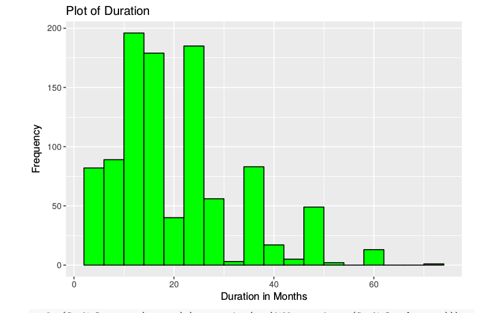
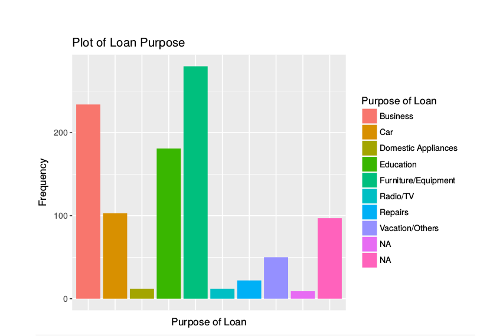

## Credit-Approval-Recommendation-System

### Decision Trees 

A decision tree is a classifier that partitions data recursively into to form groups or classes. This can be used in discrete or continuous data for classification or regression. 

### Data Visualization

Figure 01: Age distribution 

Figure 02: Level of job 

Figure 03: Housing status 

Figure 04: Saving status 

Figure 05: Checking status 

Figure 06: Histogram of credit amount 

Figure 07: loan duration distribution

Figure 08: Loan purpose

Figure 09: Decision Tree model

What is the accuracy of your tree model?

The Algorithm used in the decision trees are ID3 , C4.5, CART, C5.0, CHAID, QUEST, CRUISE, etc.
This Exercise Use C5.0 algorithm and CART for German credit data set.
C5.0(Without Boosting) accuracy is 0.73

### Boosting the accuracy of decision trees

This is a process in which many decision trees are built and the trees vote on the best class for each example. The C5.0() function makes it easy to add boosting to our C5.0 decision tree and it  needs to add an additional trials parameter indicating the number of separate decision trees to use in the boosted team.
C5.0 With boosting accuracy is 0.74

#### Recursive partitioning trees accuracy without pruning = 0.67

The recursive portioning tree includes two main processes:

01. recursion

02. partitioning.  

#### Recursive partitioning trees accuracy with pruning = 0.74

According to the above results it can be concluded that C5.0 has more accuracy than rpart().

### Random Forests 

The random forest output notes that it included 500 trees and tried number of four variables at each split. out-of-bag error rate is 23.22%

Accuracy is 0.75

What is the result compared to decision trees and random forests? 

Decision tree accuracy C5.0 = 0.73
Decision tree accuracy C5.0 with boosting = 0.74
Decision tree accuracy rpart without pruning = 0.67
Decision tree accuracy rpart with pruning = 0.74

Random forest accuracy = 0.75
The decision tree with  C5.0 has error rate 27%. but with boosting it will reduce to 25% .
The decision tree with  rpart() has error rate 33%. but with pruning  it will reduce to 25% . But Random forest provides more accuracy model by reducing  error rate to 23.22%. 

### References

Lantz, B. (2013). Machine Learning with R. Packt Publishing Ltd.

UCI Machine Learning Repository: Wine Quality Data Set. (n.d.). Retrieved June 4, 2017, from https://archive.ics.uci.edu/ml/datasets/wine+quality

Yu-Wei, C. (2015). Machine Learning with R Cookbook. Birmingham, England: Packt Publishing.

